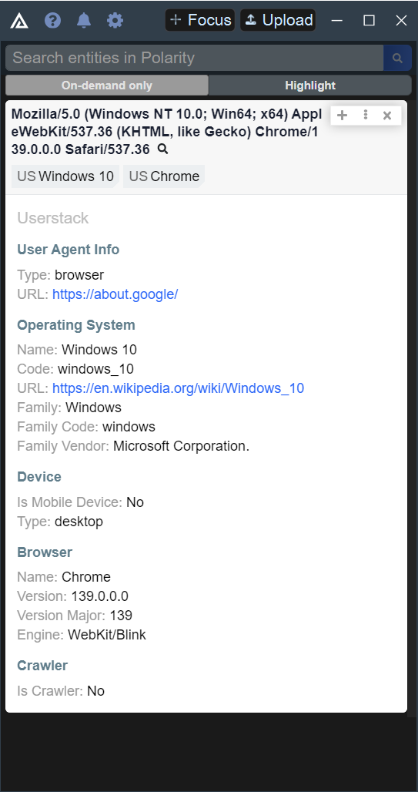

# Polarity Userstack Integration

The Polarity Userstack integration searches User Agent strings against the Userstack API.  The integration requires that the user agent string include a version to be considered as a user agent string.  Since the format for user agent strings is so open ended and can match almost anything with a `/` in it, the integration prompts the user before running a search in order to conserve lookup requests aginst the Userstack API.  This behavior can be disabled by turning off the "Show Search Prompt" option.

Below is the expected user agent format:

```
{{token}}/{{product-version}}
```

The following are examples which are treated as possible User Agent strings

```
Mozilla/5.0 (Windows NT 10.0; Win64; x64) AppleWebKit/537.36 (KHTML, like Gecko) Chrome/139.0.0.0 Safari/537.36
Googlebot-Video/1.0
Mozilla/5.0 (compatible; Googlebot/2.1; +http://www.google.com/bot.html)
Mozilla/5.0 (iPad; CPU OS 16_5 like Mac OS X) AppleWebKit/605.1.15 (KHTML, like Gecko) Version/16.5 Mobile/15E148 Safari/604.1
Dalvik/2.1.0 (Linux; U; Android 6.0.1; Nexus Player Build/MMB29T)
```



## Polarity-Userstack Integration Options

### Userstack API Access Key

The API URL of the ThreatConnect instance you would like to connect to (including http:// or https://). If you are running an internal instance of ThreatConnect on a non-default port, please specify the port here as well.

### Show Search Prompt

If enabled, the integration will prompt the user before running a search. It is recommended to leave this enabled unless you are using a paid Userstack account to prevent exhausting your lookups. Defaults to true.

## Installation Instructions

Installation instructions for integrations are provided on the [PolarityIO GitHub Page](https://polarityio.github.io/).

## Polarity

Polarity is a memory-augmentation platform that improves and accelerates analyst decision making. For more information about the Polarity platform please see:

https://polarity.io/
